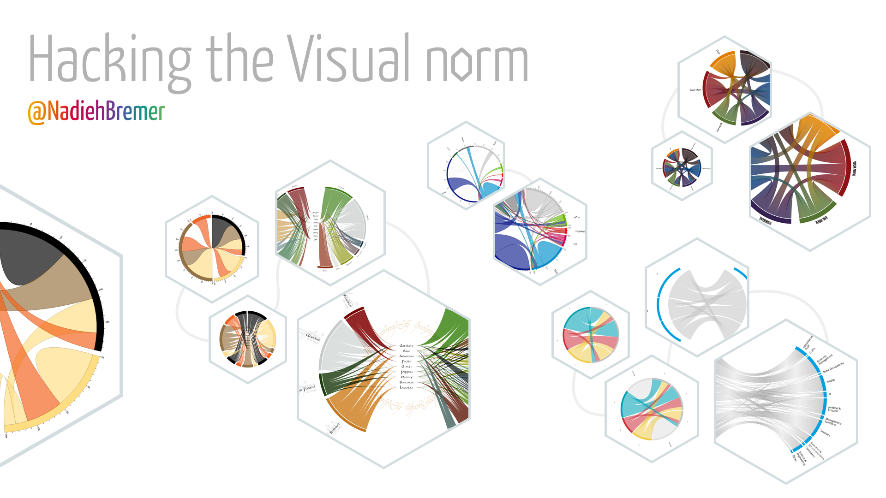

#Hacking the Visual Norm
##### About the different ways that you can take your data visualization beyond the default

In this repo you can find the slides and underlying code for my talk called "Hacking the Visual Norm". It might take a few seconds to load, but you should see something within ±10 seconds (note that the presentation has a few CPU heavy slides, especially those with continuously moving objects).

####Please, please look at these slides in Chrome

Tested with Chrome, Firefox and Safari. Definitely meant to be seen in Chrome. Even more so at a resolution of 1920x1080

[Hacking the Visual Norm](https://nbremer.github.io/hackingthevisualnorm/)

###Extras

With interactive slides build with HTML, CSS & JavaScript (and d3 v3 & 4) there are a few extra things possible. Of course there are also a few things that don't work in all browsers (but I really try :) )

#####Interactivity

- In the "voronoi-scatter-plot" slide/section where you see a simple scatterplot there are mouseovers after clicking next once. This section is about creating better UX with mouseovers by using the voronoi technique, so the next clicks will have progressively better tooltips, so start hovering :)
- in the "voronoi-baby-names" and "brush-baby-names" slides showing the end state of my baby names project you can hover over lines to see which names the lines represent. Click a name to see that name's entire stay in the top 10. Als move or increase the size of the bottom small window to see more or less years at the same time
- In the slides "brush-bar-update-data" and (3 clicks on) "brush-bar-clip-data" there are rainbow bar charts. Here you can move the window in the mini bar chart up and down, increase its size you can see the main bar chart update. Although the 1st one doesn't have good UX (that's the point I make in my presentation ;) that was just my first approach)
- In the slide "loom-lotr-final" showing the final result of my LotR project you can hover over the locations and fellowship members to see more details

#####Autmatic transitions

There's one automatic slide in the presentation (i.e. something that automatically goes through "fragments" on a slide). It's the third slide "radial-plot-evolution" with the radial bar chart. After clicking once the visual will morph into its final state until it has reached the final static fully realized chart

#####Notes

If you're looking at the presentation at a different resolution than 1920x1080 the text has the tendency to twitch whenever you click on the next arrow and an animation occurs within the same slide. Not sure why this is...

The slides are meant to be viewed in a forward direction. I tried to make all slides work while you click back as well, but there might be some things that don't run quite right.

If, for whatever strange reason, you don't want to use Chrome, here are some quirks with other browsers:

- Safari can't handle the moving slider in the "intro-slider", so I've deactivated the slider movement for Safari
- The same is true for the "intro-brush" slide where I'm just showing an entire rainbow instead of a sliding one in Safari
- The growing lines in the "intro-shopperdna" seem to disappear sometimes in Safari and have strange artifacts in Firefox, haven't looked into why
- Never checked in IE, I'm guessing it would just be too horrible to look at...

Inside the slides folder you'll see another layer of folders. Here each slide has gotten its own folder, but the numbering is based on the order in which I made them and not on the order on which they appear on the screen (this you can find in the index.html file).

I've removed one slide that contained a movie about Adyen's shopperDNA where I couldn't blur some of the values visible. Also I've replaced the working demo of Adyen's interactive organogram with a movie showing the same things as I did during my presentation

I've used the code developed by [ptamarit](https://github.com/hakimel/reveal.js/issues/456) to use D3 (and D3 transitions) in RevealJS slides 
